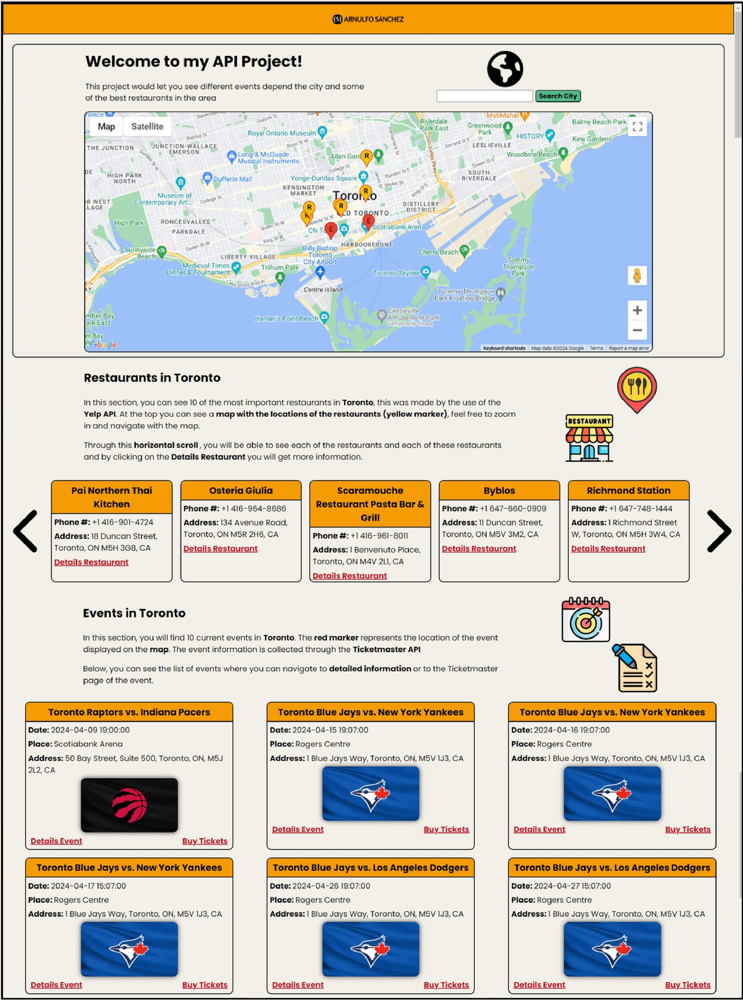
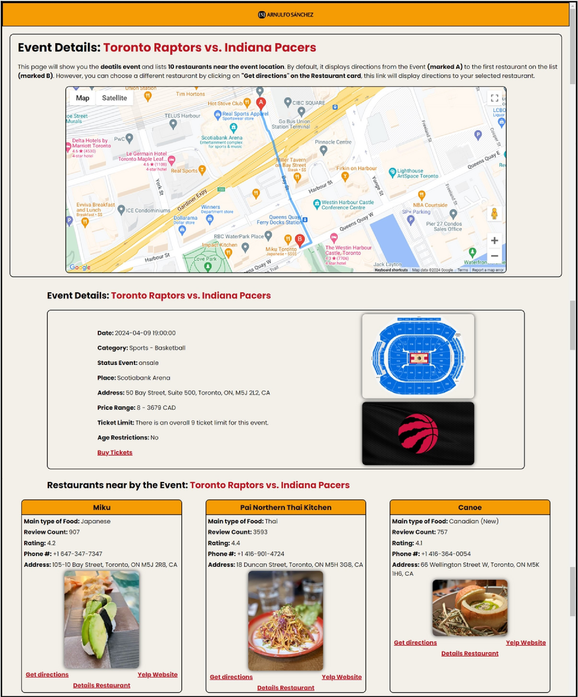
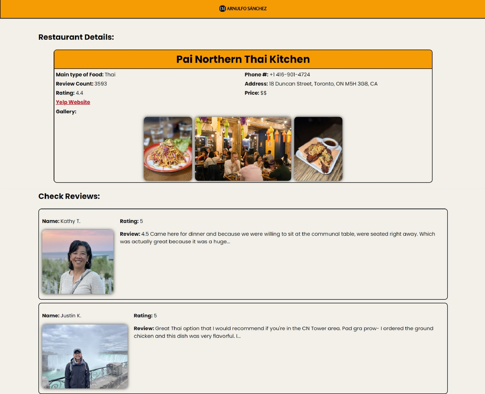

# Events and Restaurants happening in Toronto and other cities
This is a user-friendly web app that enables users to explore various events and restaurants based on their chosen city through an input interface. 
The project involves the integration of three APIs:
* Google Maps API
* Ticketmaster API
* Yelp API

## Tech Stack
* Node.js
* API
* Express
* Pug template engine

## Homepage

The homepage will show a list of events and restaurants that are happening in Toronto. Additionally, you can see the location of the events and restaurants on the map.

## Event details in Toronto

This page will illustrate the details of an event that was selected, in this case, this event is happening in Toronto

## Restaurant details in Toronto

This page will illustrate some information about the selected restaurant and some reviews that were provided by Yelp API

* The pictures of the reviewers were taken from the Yelp API

## Setup Instructions
1. Clone the repository to your local machine.
2. Install dependencies using `npm install` or `npm i`.
3. Add your own API keys
   - Google Maps API Key (Maps JavaScript API, Directions API)
   - Ticketmaster API Key
   - Yelp API Key
   - Fontawesome Key
4. Check the documentation to create your logic to display the markers (I did not add them, because I made my logic to display them with the help of the documentation, you can make yours with the help of the documentation)
5. Run the server using `npm run dev`.
6. Access the application in your web browser at http://localhost:8888.

## Usage
1. Navigate to the homepage to see different Events and Restaurants in Toronto.
2. Use the search bar to look for cities in North America (Ticketmaster is mainly used in North America, I recommend searching for cities in North America).
3. You can zoom in/zoom out the map displayed.
4. Navigate to details of the events by clicking on "Details Event".
  - In the Details you will see the route to 10 of the closest Restaurants to this event.
  - You can change the routes of the restaurant by clicking on "Get directions".
  - Additionally, you can navigate to the details of each restaurant where you cand see details and reviews of the selected restaurant

## Acknowledgements

Special thanks to Google, Ticketmaster, Yelp, Node.js, Express, and Pug for their amazing tools, APIs, and frameworks that made this project possible.
